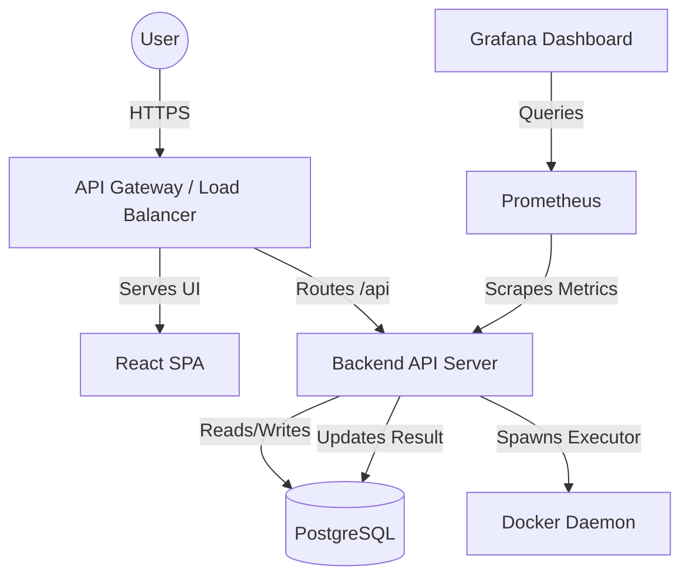

# 2. High-Level Design (HLD)

## 2.1. System Context Diagram
The system acts as an interactive coding platform where users can solve problems, submit code, view results, and engage in discussions.

---

## 2.2. Data Flow & Communication Patterns

### A. Authentication Flow
1. **Login/Register**: User sends credentials to `/api/auth/login`.
2. **Token Generation**: Backend validates credentials, generates a short-lived Access Token (JWT) and a long-lived Refresh Token (stored securely).
3. **Authorization**: Subsequent API requests include the JWT in the `Authorization: Bearer <token>` header.
4. **Validation**: The Backend API validates the JWT signature and expiration before processing the request.

### B. Code Execution Flow (Asynchronous)
1. **Submission**: User submits code via `/api/submissions`.
2. **Database Entry**: API creates a `Submission` record in PostgreSQL with status `PENDING`.
3. **Execution Initiated**: API fires the `processSubmission()` function asynchronously and immediately responds to the user with `submission_id` and status `202 Accepted`.
4. **Execution Lifecycle**:
   - The backend runs the execution wrapper via `dockerSandbox.js` inside a tightly constrained Docker container.
   - The code is compiled (if necessary) and run against each test case.
   - The backend collects output and compares it against expected output.
5. **Result Handling**:
   - Depending on outcome, status is marked as `ACCEPTED`, `WRONG_ANSWER`, `TLE` (Time Limit Exceeded), `MLE` (Memory Limit Exceeded), `RE` (Runtime Error), or `CE` (Compilation Error).
   - The backend updates the `Submission` record in PostgreSQL with the final status, execution time, and memory used.
   - If `ACCEPTED`, the User's score/rank in the `Leaderboard` is updated.

### C. Polling/Result Retrieval Flow
1. **Status Checking**: From the Frontend, once a submission is lodged, it polls `/api/submissions/:id` every 1-2 seconds (or uses WebSockets/SSE to receive an event).
2. **Completion**: Once the `Submission` status in PostgreSQL changes from `PENDING`, the Frontend stops polling and displays the final result block to the user.

---

## 2.3. Distributed & Scalability Elements

*   **Stateless Component approach**: The API layer (Node.js/Express) relies entirely on JWTs and PostgreSQL. 
*   **Asynchronous Execution**: Heavy CPU operations (compiling and executing user code) are handled without blocking the API response by processing submissions asynchronously.
*   **Database Scaling**: Read operations (Problem Lists, Leaderboard) significantly outnumber writes. We can implement Database Read Replicas (Master-Slave architecture) if traffic grows.
*   **Container Concurrency**: Docker runs ephemeral containers. Workers manage concurrency limits to avoid exhausting host OS resources.

---

## 2.4. Hardened Security Design (Code Execution Sandbox)

To prevent severe system abuse (fork bombs, infinite loops, crypto mining, network attacks, system call exploits):

1.  **Isolation (Namespaces & Cgroups)**: Every user submission runs in a fresh, isolated Docker container representing that specific language environment.
2.  **No Network Access**: The `--network=none` flag ensures the container has no internet access, preventing crypto-mining or botnet participation.
3.  **Strict Resource Quotas**: 
    - `--memory=256m`: Caps RAM per execution.
    - `--cpus=0.5`: Throttles CPU, mitigating pure CPU abuse.
    - `--pids-limit=64`: Stops fork bombs from consuming all process IDs.
4.  **Filesystem Restrictions**:
    - `--read-only`: The root filesystem is strictly read-only.
    - Execution scripts are mounted into the container. Output/eval runs without modifying the container image.
5.  **Privilege Dropping**:
    - `--security-opt=no-new-privileges`: Precludes elevation of privilege via `setuid` binaries.
    - The container runs as a non-root OS user.
6.  **Timeouts (Defense in Depth)**:
    - Inner timeout: The language runner script enforces a rough timeout (e.g., using Bash `timeout` or language equivalents).
    - Outer timeout: The Node.js backend kills the Docker container after exactly 5.5 seconds if it hasn't terminated, handling any runaway zombie processes.

---

## 2.5. Error Handling & Reliability

*   **Database Transactions**: Updates to the Submission state and the Leaderboard are performed within a single database transaction to maintain data consistency.

This high-level approach ensures a system that is robust against malicious code, horizontally scalable to handle traffic spikes, and built using maintainable, decoupled services.
